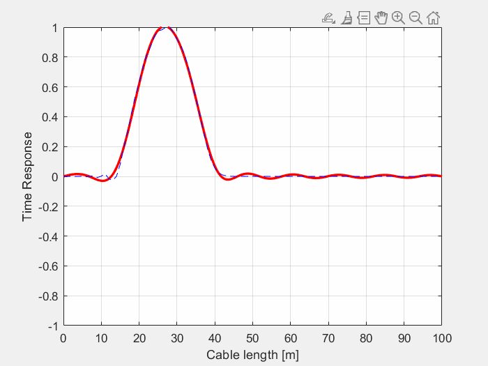
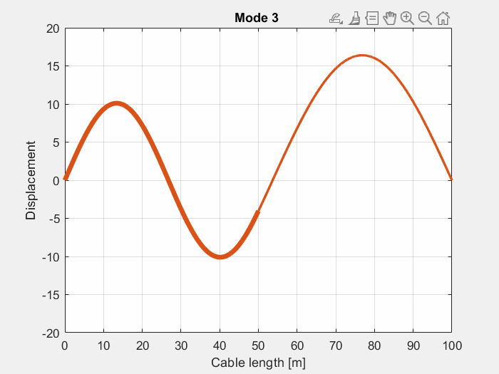

# Tensioned Cable Dynamics and Natural Frequencies

This repository contains MATLAB scripts for the analysis of tensioned cables subjected to various boundary and loading conditions. Each script provides a computational approach to identify natural frequencies and simulate the dynamic response of the cable using physically grounded wave propagation models.

## Overview

The objective of this work is to analyze the vibrational modes and time-domain behavior of tensioned cables under different physical configurations. Each script solves for the natural frequencies within a defined frequency range and computes the dynamic response using analytical and numerical techniques. The key focus is on modeling wave propagation in cables—both progressive/regressive and standing waves—and accounting for geometrical or mass discontinuities.

## Scripts Description

### `TensionedCable.m`

This script solves for the natural frequencies and dynamic response of a uniform tensioned cable using **progressive and regressive wave theory**. It formulates the problem as a determinant of a boundary condition matrix, extracts modal shapes, and visualizes both static and time-varying responses. Additionally, it demonstrates the superposition of travelling waves as a dynamic solution.

  

### `TensionedCable_IC.m`

This version evaluates the dynamic response of a cable based on a prescribed **initial displacement profile** and zero initial velocity. The solution is obtained using a **standing wave decomposition**, where the initial condition is projected onto modal shapes. The modal contributions are then evolved in time using cosine functions. This approach highlights the orthogonality and completeness of the modal basis for reconstructing initial states.

  

### `TensionedCable_2SD.m`

This script models a cable composed of **two segments with different mass per unit length**. It calculates the natural frequencies and modal shapes, accounting for the discontinuity at the midpoint. The dynamic response is also analyzed under the action of an **external harmonic force** applied at the interface between the two segments. The solution combines the wave transmission and reflection phenomena at the mass discontinuity.

  

## Features

- Frequency sweep to detect resonances and identify modal frequencies.
- Mode shape visualization and animation.
- Analytical formulation of boundary value problems.
- Time-domain simulations using modal superposition.
- Support for both free vibration and forced harmonic excitation.

## Requirements

- MATLAB R2021a or newer
- Standard plotting and signal processing toolboxes

## How to Use

1. Clone or download the repository.
2. Open the desired `.m` file in MATLAB.
3. Run the script and follow the prompts (e.g., mode selection, frequency inputs).
4. Inspect the generated plots and animations for frequency response and cable deformation.
